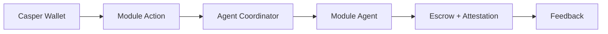

# Casper AgentVault

  

  <strong>The unified smart wallet for agentic DeFi and RWA on Casper Network.</strong> 
  One wallet. Three autonomous modules.

  <a href="https://casperagent.xyz">casperagent.xyz</a>

  

## Overview

| Module | Purpose |
|--------|---------|
| **Portfolio Guardian** | Yield optimization and risk monitoring |
| **RWA Oracle** | Compliance attestations for real-world assets |
| **Agent Marketplace** | Escrow-powered hiring with on-chain reputation |

## How It Works

## Stack

| Layer | Technology |
|-------|------------|
| Blockchain | Casper Network, Odra |
| Wallet | CSPR.click, Casper Wallet |
| Settlement | Escrow and Attestation contracts on casper-test |

## Documentation

In-app documentation is available at [casperagent.xyz/docs](https://casperagent.xyz/docs):

- Getting Started
- Wallet & Faucet
- Architecture
- Portfolio Guardian, RWA Oracle, Agent Marketplace
- Smart Contracts

## Contracts

| Contract | Entry points |
|----------|--------------|
| Escrow | `init`, `verify_and_release` |
| Attestation | `init`, `update_reputation` |

Deployed package hashes for casper-test are in `contracts/agentvault-core/resources/casper-test-contracts.toml`.

## License

MIT