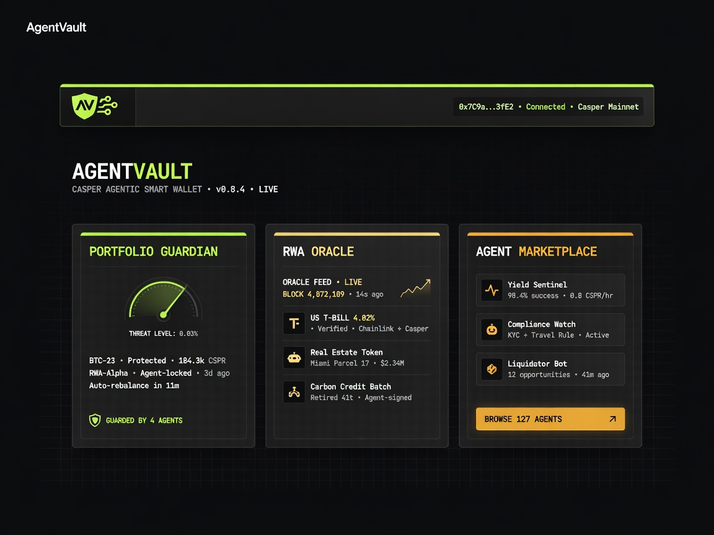
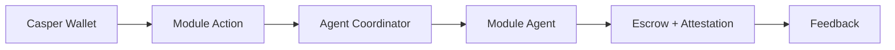

# Casper AgentVault

<p align="center">
  
</p>

<p align="center">
  <strong>The unified smart wallet for agentic DeFi and RWA on Casper Network.</strong><br />
  One wallet. Three autonomous modules.
</p>

<p align="center">
  
</p>

## Overview

| Module | Purpose |
|--------|---------|
| **Portfolio Guardian** | Yield optimization and risk monitoring |
| **RWA Oracle** | Compliance attestations for real-world assets |
| **Agent Marketplace** | Escrow-powered hiring with on-chain reputation |

## How It Works



## Tech Stack

| Layer | Stack |
|-------|-------|
| Blockchain | Casper Network, Odra |
| Frontend | Next.js, React, Tailwind CSS |
| Wallet | CSPR.click |
| Agents | LangChain, coordinator pattern |

## Quick Start

**Agents**

```bash
cd agents && npm install && npm run build && npm test
```

**Frontend**

```bash
cd frontend && cp .env.example .env.local && npm install && npm run dev
```

Open [http://localhost:3000](http://localhost:3000).

**On-chain** — set `NEXT_PUBLIC_ESCROW_PACKAGE_HASH` and `NEXT_PUBLIC_ATTESTATION_PACKAGE_HASH` in `frontend/.env.local` after deploy.

## Project Structure

```
casper-agentvault/
├── agents/       # Multi-agent reasoning
├── contracts/    # Odra smart contracts
├── frontend/     # Dashboard + wallet UI
└── docs/assets/  # README visuals
```

## Contracts

- **Escrow** — `init`, `verify_and_release`
- **Attestation** — `init`, `update_reputation`

## License

MIT