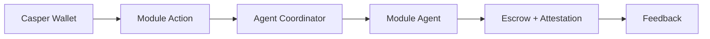

# Casper AgentVault

<p align="center">
  
</p>

<p align="center">
  <strong>Autonomous operating system for on-chain AI agents.</strong><br />
  One platform — Finance, Compliance, and Commerce applications on Casper.
</p>

<p align="center">
  <a href="https://casperagent.xyz">casperagent.xyz</a>
  ·
  <a href="https://casperagent.xyz/docs">Docs</a>
  ·
  <a href="docs/JUDGE_PLAYBOOK.md">Judge playbook</a>
  ·
  <a href="docs/TESTNET.md">Testnet hashes</a>
</p>

<p align="center">
  
</p>

[](https://github.com/rudazy/casper-agentvault/actions/workflows/ci.yml)
[](https://github.com/rudazy/casper-agentvault/actions/workflows/codeql.yml)
[](./LICENSE)

---

## What this is

AgentVault is a single operating system for autonomous agents on **Casper Network**:

| Application | Domain | On-chain surface |
|-------------|--------|------------------|
| **Portfolio Guardian** | Finance | Live CSPR balance via RPC; agent-guided monitoring |
| **RWA Oracle** | Compliance | **Attestation** package — `init`, `update_reputation` |
| **Agent Marketplace** | Commerce | **Escrow** package — `init`, `verify_and_release` |

Shared layers: Casper Wallet (CSPR.click), multi-agent coordinator, Odra smart contracts on **casper-test**.

## Live MVP

| Item | Value |
|------|--------|
| App | https://casperagent.xyz |
| Network | `casper-test` |
| Escrow package | `hash-75e9a98ffc98b9e7661a40f7a2ce0dfb382c1dd156bc3781c8b187310e5809cb` |
| Attestation package | `hash-25825b6d3e456ecc37eb77a15eecd8369dbfdf33c55aaf744f1a0007fe37db95` |
| Explorer (Escrow) | [testnet.cspr.live](https://testnet.cspr.live/contract-package/75e9a98ffc98b9e7661a40f7a2ce0dfb382c1dd156bc3781c8b187310e5809cb) |
| Explorer (Attestation) | [testnet.cspr.live](https://testnet.cspr.live/contract-package/25825b6d3e456ecc37eb77a15eecd8369dbfdf33c55aaf744f1a0007fe37db95) |

Full package + sample transaction table: **[docs/TESTNET.md](docs/TESTNET.md)**  
End-to-end judge steps: **[docs/JUDGE_PLAYBOOK.md](docs/JUDGE_PLAYBOOK.md)**

## How it works



1. User connects Casper Wallet on casper-test.
2. Dashboard action is routed through the agent coordinator.
3. Domain agent returns a structured recommendation (mode: mock / rpc / transaction).
4. Transaction modes build a contract package call; user signs in wallet.
5. Settlement is visible on testnet.cspr.live via the transaction hash.

## Repository layout

```
casper-agentvault/
├── frontend/          # Next.js dashboard + in-app docs (Vercel)
├── agents/            # TypeScript multi-agent coordinator
├── contracts/
│   └── agentvault-core/   # Odra contracts (Escrow, Attestation, Vault)
├── docs/              # Assets, judge playbook, testnet reference
└── .github/           # CI, CodeQL, Dependabot, templates
```

## Stack

| Layer | Technology |
|-------|------------|
| App | Next.js, React, TypeScript, Tailwind |
| Agents | TypeScript, LangChain (optional LLM) |
| Contracts | Rust, Odra, Casper |
| Wallet | CSPR.click, Casper Wallet |
| Network | Casper testnet (`casper-test`) |

## Quick start (local)

### Prerequisites

- Node.js 20+
- npm
- (Optional) Rust nightly from `contracts/agentvault-core/rust-toolchain` for contract tests
- Casper Wallet for full e2e

### Agents

```bash
cd agents
npm ci
npm run build
npm test
```

### Frontend

```bash
cd frontend
cp .env.example .env.local
# Set NEXT_PUBLIC_CSPR_CLICK_APP_ID for your domain (localhost template works locally)
npm ci
npm run dev
```

Open http://localhost:3000.

Environment variables are documented in `frontend/.env.example`. Never commit secrets or `*.pem` keys.

### Contracts

```bash
cd contracts/agentvault-core
cargo test
```

Deployed package hashes for the public MVP:

```
contracts/agentvault-core/resources/casper-test-contracts.toml
```

## Documentation

| Resource | Link |
|----------|------|
| Product docs | https://casperagent.xyz/docs |
| Getting started | https://casperagent.xyz/docs/getting-started |
| Wallet & faucet | https://casperagent.xyz/docs/faucet |
| Architecture | https://casperagent.xyz/docs/architecture |
| Smart contracts | https://casperagent.xyz/docs/contracts |
| Judge testing playbook | [docs/JUDGE_PLAYBOOK.md](docs/JUDGE_PLAYBOOK.md) |
| Testnet hashes & sample txs | [docs/TESTNET.md](docs/TESTNET.md) |
| Buildathon checklist | [docs/BUILDATHON_CHECKLIST.md](docs/BUILDATHON_CHECKLIST.md) |

## Smart contracts (MVP)

| Contract | Entry points | Role |
|----------|--------------|------|
| **Escrow** | `init`, `verify_and_release` | Marketplace job funding and owner-gated release |
| **Attestation** | `init`, `update_reputation` | RWA data hash + issuer reputation score |

Each package call in the app reserves **5 CSPR** payment (`DEFAULT_DEPLOY_COST`). Use the [testnet faucet](https://testnet.cspr.live/faucet).

A **Vault** module (agent session keys with spend caps) exists in source for the next slice; it is not part of the required judge path until a testnet package hash is published in `docs/TESTNET.md`.

## Security

- Report vulnerabilities privately — see [SECURITY.md](./SECURITY.md)
- Dependabot + CodeQL workflows live under `.github/`
- No private keys in the public app path; users sign with Casper Wallet

## Contributing

See [CONTRIBUTING.md](./CONTRIBUTING.md) and the [Code of Conduct](./CODE_OF_CONDUCT.md).

## License

[MIT](./LICENSE)

## Community

- Casper Developers Telegram: https://t.me/CSPRDevelopers
- Casper Network Discord: https://discord.com/invite/caspernetwork
